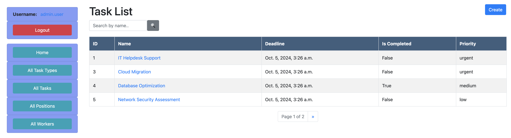

# Task Manager

Django project for managing tasks.
Manage your tasks efficiently with Task Manager.

# Check it out!
[Task Manager project deployed to Render]()

In order to log in to the website you can use test user credentials or sign-up:
```shell
login: user
password: user12345
```

## Installation

Python3 must be already installed

```shell
git clone https://github.com/IProskurnytskyi/company-task-manager
cd company-task-manager
python -m venv venv
if macOS: source venv/bin/activate
if Windows: venv\Scripts\activate.bat
pip install -r requirements.txt
python manage.py runserver
```
Here you clone git repository into your computer, change working directory then
you activate virtual environment in order to install requirements.txt virtually (not into your operating system)
and activate it. Then you install required modules and run server.

## Features

* Authentication functionality for Worker/User
* Registration page
* Managing workers positions tasks & task types directly from the website

## Demo



# Contributing

If you'd like to contribute, please fork the repository and use a develop branch. 
Pull requests are warmly welcome.
